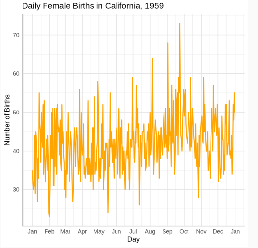

# Time Series Analysis & Forecasting: Week-1

---

# Introduction

## **Definition**  
A time series is a finite sequence of observations, denoted by $x_t$ or $x(t)$, at specific times $t \in T$, where $T$ is the set of time points at which observations are recorded.


## Types of Time Series

### Discrete-time Time Series
  - Time is measured at countable time points.
  - The time index set is typically, $T = \{t_1, t_2, \ldots, t_n\} \subset \mathbb{Z}$.
  - *Examples*: Daily stock prices, monthly sales data.

### Continuous-time Time Series
  - Time is measured continuously over an interval.
  - The time index set is typically $T \subseteq \mathbb{R}$, such as $T = [0, \infty)$.
  - *Examples*: ECG signals, temperature variation over time.


**Examples of Time Series**

- PM2.5 levels in Guwahati for 2021 (Air quality data)
- NIFTY 50 Closing Price (Stock market index)
- US international air passenger bookings (1949–1960)


## What is Forecasting in Time Series?

Given a time series (e.g., daily temperature for the past month), a natural question is:  
> "What will the temperature be tomorrow?"

Forecasting is the process of predicting future values based on patterns observed in the past.


## Goals in Time Series

- Understand the underlying patterns in the data.
- Set up a statistical model to describe observed patterns.
- Spot unusual behavior, such as outliers.
- Use the model to forecast future behavior of the series.
- Use the model to control a system.


## **Applications of Time Series**

- Economic forecasting
- Financial market analysis
- Weather forecasting
- Yield projections
- Census analysis
- Many other fields

---


# Time Series Decomposition

---

## **1. Components of a Time Series**

A time series can be broken down into several underlying components, each representing a distinct pattern or source of variation:

<p>
    
</p>

- **Trend Component ($T_t$)**  
  Represents the long-term movement or direction in the data over time. This could be an upward or downward drift due to factors like population growth, technological change, or economic development.

- **Seasonal Component ($S_t$)**  
  Captures periodic fluctuations that repeat at regular intervals (e.g., daily, monthly, yearly). These are due to seasonal factors such as weather, holidays, or recurring events.

- **Cyclical Component**  
  Refers to long-term oscillations that are not of fixed period, often related to economic or business cycles. Unlike seasonality, cycles can vary in length and intensity.

- **Random/Irregular Component ($I_t$)**  
  Represents unpredictable, irregular, or random fluctuations not explained by the other components. These are caused by unexpected events like natural disasters, strikes, or other shocks.

---

## **2. Mathematical Decomposition of a Time Series**

A time series $x_t$ can be expressed as a function of its components:

$$
x_t = f(T_t, S_t, I_t)
$$

There are two main models for decomposition:

### **Additive Model**

$$
x_t = T_t + S_t + I_t
$$

- Used when the magnitude of seasonal and irregular variations does not depend on the level of the series.
- Appropriate if seasonal fluctuations remain constant over time.

### **Multiplicative Model**

$$
x_t = T_t \times S_t \times I_t
$$

- Used when the magnitude of seasonal and irregular variations changes proportionally with the level of the series.
- Common in economic and business time series where seasonal effects grow with the trend.

---

**3. Log Transformation**

- A multiplicative model can be converted to an additive model by taking logarithms:
  $$
  x_t = T_t \times S_t \times I_t \implies \log x_t = \log T_t + \log S_t + \log I_t
  $$
- Log transformation is useful for stabilizing variance and simplifying analysis[1].

---

**4. Practical Example: US Employment Dataset**

- Both additive and multiplicative decompositions can be applied to real-world data such as US employment figures.
- The choice between additive and multiplicative models depends on whether seasonal and irregular variations are constant or proportional to the trend.

<p>
    
</p>


**5. Choosing Between Additive and Multiplicative Models**

- **Additive:** Use when seasonal variation is roughly constant throughout the series.
- **Multiplicative:** Use when seasonal variation increases or decreases with the trend.


**6. Summary Table: Decomposition Models**

| Model Type      | Formula                              | When to Use                                              |
|-----------------|--------------------------------------|----------------------------------------------------------|
| Additive        | $$ x_t = T_t + S_t + I_t $$          | Seasonal/irregular variation does not depend on level    |
| Multiplicative  | $$ x_t = T_t \times S_t \times I_t $$| Seasonal/irregular variation proportional to series level|


---

#  Trend in Time Series Analysis


## **Definition of Trend**

- A trend in a time series refers to the long-term movement or direction in the data over an extended period.
- Trends can be:
  - **Upward:** Persistent increase in the level over time.
  - **Downward:** Persistent decrease in the level over time.
  - **No Trend (Stationary):** No clear long-term increase or decrease; values fluctuate around a constant mean.


**Importance of Identifying Trends**

- Recognizing trends helps in understanding the general direction of a dataset, which is essential for forecasting, planning, and decision-making in business, economics, and other fields.
- Trends reflect underlying changes due to factors like population growth, technological advancement, consumer preferences, and economic conditions.

---

**Examples of Trends in Real Data**

- **US Employment Dataset:** Shows a general upward trend in employment numbers from 1944 to 2014, reflecting economic growth and population increase.
- **S&P 500 Index (2008 Financial Crisis):** Demonstrates a downward trend during the crisis period, indicating a persistent fall in stock prices.
- **Female Births in California (1959):** May show little to no trend, with daily births fluctuating but not exhibiting a clear increase or decrease.

<p>
    
</p>
---

## **Types of Trends**

| Trend Type | Description                          |
|------------|--------------------------------------|
| Upward     | Values increase with time            |
| Downward   | Values decrease with time            |
| No Trend   | Values fluctuate without clear drift |

---

**Questions for Critical Thinking**

- Can you think of a time series that will have an upward trend?  
  *Examples: World population, cumulative sales of a successful product, technological adoption rates.*
- Can you think of a time series that will have a downward trend?  
  *Examples: Landline telephone subscriptions, sales of outdated technology, declining industries.*
- Can you think of a time series that will have no apparent trend?  
  *Examples: Daily temperature in a tropical region (over a short period), random noise.*

---

**Key Points to Remember**

- Trend is a fundamental component of time series analysis, representing long-term progression.
- Not all time series have a trend; some may be stationary.
- Recognizing the presence and type of trend is a critical first step before applying forecasting models or further decomposition.


# Seasonality in Time Series

---

## **1. What is Seasonality?**

- **Seasonality** refers to repeating patterns or regular fluctuations in a time series that occur at fixed intervals, such as months, weeks, days, or quarters.
- These patterns are due to systematic influences like calendar effects (e.g., holidays), weather, or recurring events.

---

## **2. Types of Seasonality**

| Seasonality Type | Description                      |
|------------------|----------------------------------|
| Monthly          | Pattern repeats every month      |
| Weekly           | Pattern repeats each week        |
| Daily/Hourly     | Pattern within each day          |
| Quarterly        | Pattern repeats every quarter    |

---

## **3. Visualizing Seasonality**

### **A. Seasonal Plot**

- Plots data against the individual "seasons" (e.g., months, weeks) in which the data were observed.
- Reveals the underlying seasonal pattern more clearly.

#### **Example: AirPassengers Data**
- Each line = one year.
- Shows strong, regular seasonal cycles:
  - Lowest: Jan–Feb
  - Increase: Mar–Jul
  - Peak: Jul or Aug
  - Decline: Sep–Dec
- Upward trend over time is visible as yearly lines shift upward, indicating growing demand.

**R Code Example:**
```r
# Load data
data("AirPassengers")
# Seasonal plot
library(forecast)
seasonplot(AirPassengers, col=rainbow(12), year.labels=TRUE, main="Seasonal plot: AirPassengers")
```

<p>
    
</p>

---

### **B. Seasonal Subseries Plot**

- Plots each season (e.g., each month) separately across years.
- Useful for visualizing trends and variations within each season and identifying shifts in seasonal patterns.

**Interpretation (AirPassengers Example):**
- Each panel = one month (Jan–Dec), showing changes over years.
- Jan–Mar: Low traffic
- Jul–Aug: Peak (summer holidays)
- Nov–Dec: Secondary increase (holiday travel)
- Horizontal blue lines: Average passenger count for each month

**R Code Example:**
```r
monthplot(AirPassengers, main="Seasonal Subseries Plot: AirPassengers")
```

<p>
    
</p>

## **4. Seasonal vs Cyclical Fluctuations**

| Seasonal Fluctuations                | Cyclical Fluctuations                    |
|--------------------------------------|------------------------------------------|
| Fixed length (e.g., 12 months)       | Varying length (no fixed period)         |
| Calendar-related (holidays, weather) | Driven by economic/business cycles       |
| Repeats at consistent intervals      | No fixed repetition; irregular intervals |
| Short-term (within a year)           | Longer-term (several years)              |
| Magnitude less variable              | Magnitude more variable                  |

---

# [Preliminary Tests](./PreliminaryTest.md)